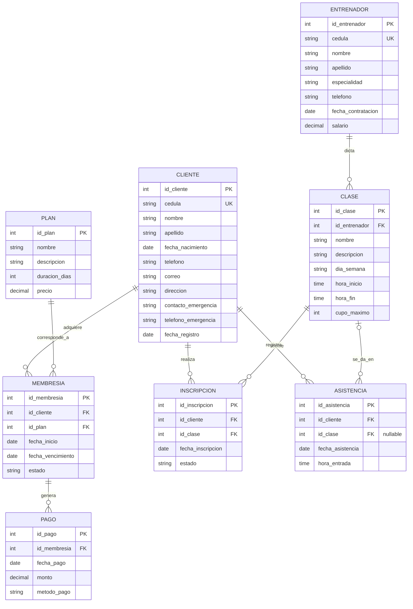

# Power Gym — Modelo Entidad-Relación (Conceptual)

**Proyecto:** Power Gym
**Entrega:** Modelo conceptual de la base de datos
**Autor:** Samuel Benavides Housset

---

## 1. Entidades identificadas

| # | Entidad | Descripción |
|---|---------|-------------|
| E1 | **CLIENTE** | Persona inscrita en el gimnasio. |
| E2 | **PLAN** | Catálogo de planes de membresía ofrecidos (mensual, trimestral, etc.). |
| E3 | **MEMBRESIA** | Contrato vigente o histórico que vincula un cliente con un plan. |
| E4 | **PAGO** | Transacción económica asociada a una membresía. |
| E5 | **ENTRENADOR** | Persona contratada para dictar clases grupales. |
| E6 | **CLASE** | Sesión grupal recurrente dictada por un entrenador. |
| E7 | **INSCRIPCION** | Registro de un cliente a una clase grupal (entidad asociativa). |
| E8 | **ASISTENCIA** | Registro de la entrada de un cliente al gimnasio o a una clase. |

---

## 2. Atributos por entidad

### E1. CLIENTE
- `id_cliente` (PK, identificador)
- `cedula` (atributo único)
- `nombre`
- `apellido`
- `fecha_nacimiento`
- `telefono`
- `correo`
- `direccion`
- `contacto_emergencia`
- `telefono_emergencia`
- `fecha_registro`

### E2. PLAN
- `id_plan` (PK)
- `nombre`
- `descripcion`
- `duracion_dias`
- `precio`

### E3. MEMBRESIA
- `id_membresia` (PK)
- `fecha_inicio`
- `fecha_vencimiento`
- `estado` (ACTIVA / VENCIDA / SUSPENDIDA)

### E4. PAGO
- `id_pago` (PK)
- `fecha_pago`
- `monto`
- `metodo_pago` (EFECTIVO / TARJETA / TRANSFERENCIA)

### E5. ENTRENADOR
- `id_entrenador` (PK)
- `cedula` (único)
- `nombre`
- `apellido`
- `especialidad`
- `telefono`
- `fecha_contratacion`
- `salario`

### E6. CLASE
- `id_clase` (PK)
- `nombre`
- `descripcion`
- `dia_semana` (LUN, MAR, ..., DOM)
- `hora_inicio`
- `hora_fin`
- `cupo_maximo`

### E7. INSCRIPCION (entidad asociativa)
- `id_inscripcion` (PK)
- `fecha_inscripcion`
- `estado` (ACTIVA / CANCELADA)

### E8. ASISTENCIA
- `id_asistencia` (PK)
- `fecha_asistencia`
- `hora_entrada`

---

## 3. Relaciones y cardinalidades

| # | Relación | Entidades | Cardinalidad | Descripción |
|---|----------|-----------|--------------|-------------|
| R1 | **adquiere** | CLIENTE — MEMBRESIA | 1 : N | Un cliente puede tener varias membresías históricas; cada membresía pertenece a un único cliente. |
| R2 | **corresponde_a** | PLAN — MEMBRESIA | 1 : N | Un plan se asocia a muchas membresías; cada membresía sigue un único plan. |
| R3 | **genera** | MEMBRESIA — PAGO | 1 : N | Una membresía puede generar uno o varios pagos; cada pago corresponde a una sola membresía. |
| R4 | **dicta** | ENTRENADOR — CLASE | 1 : N | Un entrenador puede dictar varias clases; cada clase tiene un único entrenador responsable. |
| R5 | **se_inscribe** | CLIENTE — CLASE (vía INSCRIPCION) | N : M | Un cliente puede inscribirse a muchas clases y una clase tiene muchos inscritos. Se resuelve con la entidad asociativa INSCRIPCION. |
| R6 | **registra** | CLIENTE — ASISTENCIA | 1 : N | Un cliente puede tener muchas asistencias; cada asistencia corresponde a un solo cliente. |
| R7 | **se_da_en** | CLASE — ASISTENCIA | 0..1 : N | Una asistencia puede estar asociada a una clase (asistencia a clase) o ninguna (entrada libre al gimnasio). |

---

## 4. Diagrama Entidad-Relación

---

## 5. Reglas de negocio reflejadas en el modelo

- **RN1** (un cliente, una membresía activa): no se modela como restricción estructural en el ER, se implementará vía CHECK/Trigger sobre `MEMBRESIA.estado`.
- **RN2** (cupo máximo de clase): el atributo `cupo_maximo` en CLASE soporta la validación que se aplicará vía Trigger sobre INSCRIPCION.
- **RN3** y **RN4** (formato de teléfono y correo): atributos `telefono` y `correo` en CLIENTE — se validarán por CHECK en el modelo físico.
- **RN5** (vencimiento posterior al inicio): se controla con CHECK sobre MEMBRESIA.
- **RN7** (solo membresías activas inscriben): control vía Trigger en INSCRIPCION.

---

## 6. Notas de diseño

- Se usan **identificadores sustitutos** (IDs numéricos) en todas las entidades para simplificar las relaciones y permitir cambios futuros en los atributos naturales (cédula, etc.).
- La relación N:M entre CLIENTE y CLASE se descompone con la entidad asociativa **INSCRIPCION**, que además permite registrar atributos propios de la inscripción (fecha, estado).
- La entidad **ASISTENCIA** permite cardinalidad opcional con CLASE para soportar tanto **entrada libre al gimnasio** como **asistencia a clase específica**.
- Una **MEMBRESIA** puede tener múltiples **PAGOS** para soportar pagos parciales o renovaciones registradas como pagos adicionales.
